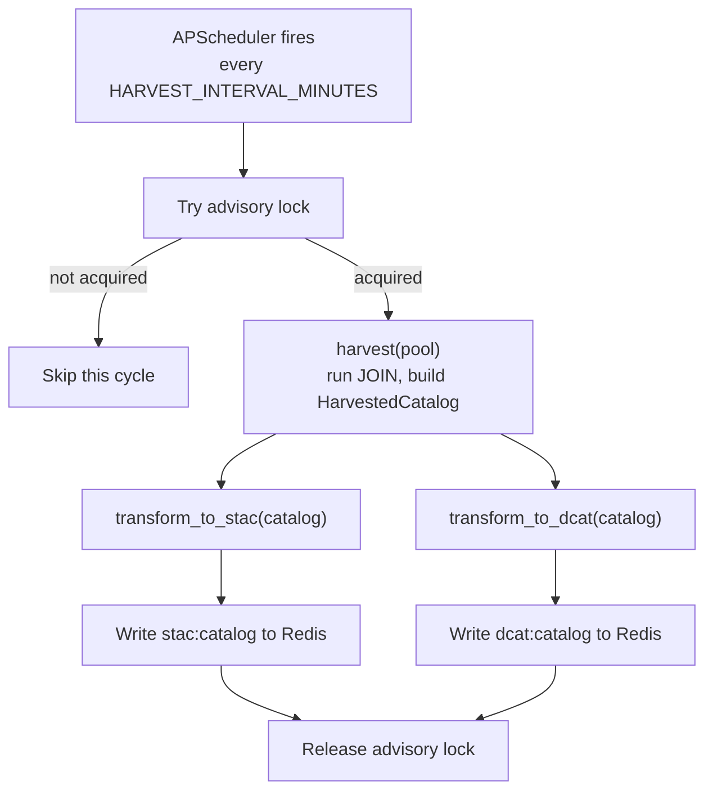

# Harvesting Layer Reference

---

## Design

**What it does.** The harvester reads metadata directly from the istSOS4 Postgres database via a single asyncpg JOIN query, normalizes the flat result rows into typed Python dataclasses, transforms them into STAC and DCAT-AP output, and writes the result to Redis. This entire pipeline runs on a fixed schedule rather than per-request. The connector's API layer is a pure reader: it never touches Postgres, it only reads whatever is currently in Redis.

**What it does not do.** The harvester does not compute derived fields. Temporal extents, spatial bounding boxes, keyword sets, observable property deduplication, none of that happens here. The harvester stores what Postgres returns. All computation belongs in the transformers, which consume the same normalized data but derive different things from it. This boundary is deliberate: the STAC and DCAT-AP transformers need the same raw data but produce structurally different outputs and also lays foundation for more standards in the future.

**Why direct Postgres instead of STA HTTP pagination.** To fetch each thing in the database, an HTTP query can either do a while loop until the iot.nextLink is absent(meaning last page according to OGC specs), which is proven to be a bad decision based on the Benchmark script ran against Fraunhofer's Air Quality Index STA endpoint, or us a query modifier and add `?$top=n` where, n = number of things in the deployment, which is optimistic at best. The same data via a single Postgres JOIN completes in well under a second with no need for guesswork. Confirmed with mentors on June 15.

---

## Scheduling model (confirmed June 15 mentor meeting)

**The cycle, end to end:**



Redis keys carry no TTL of their own. They simply hold "the latest valid cache" and are overwritten every cycle. If a cycle fails partway, the previous valid cache remains in Redis until the next successful cycle replaces it.

The advisory lock exists to stop multiple istSOS workers or replicas, each running their own APScheduler instance, from firing the harvest simultaneously and racing to write Redis. `pg_try_advisory_lock(key)` is non-blocking: it grabs the lock instantly if free, or returns `false` immediately if another session already holds it. The lock is tied to the Postgres session, not a Python variable, and stays held until that connection calls `pg_advisory_unlock` or disconnects... which is why the release sits in a `finally` block.

---

## The harvest query

One asyncpg `fetch()` call returns everything both transformers need:

```sql
SELECT
    t.id                            AS thing_id,
    t.name                          AS thing_name,
    t.description                   AS thing_description,
    t.properties                    AS thing_properties,
    ST_AsGeoJSON(l.location)::json  AS location_geometry,
    d.id                            AS ds_id,
    d.name                          AS ds_name,
    d.description                   AS ds_description,
    d."unitOfMeasurement"           AS uom,
    d."observationType"             AS observation_type,
    d."observedArea"                AS observed_area,
    d."phenomenonTime"              AS phenomenon_time,
    d."resultTime"                  AS result_time,
    d.properties                    AS ds_properties,
    op.id                           AS op_id,
    op.name                         AS op_name,
    op.description                  AS op_description,
    op.definition                   AS op_definition,
    op.properties                   AS op_properties,
    s.id                            AS sensor_id,
    s.name                          AS sensor_name,
    s.description                   AS sensor_description,
    s."encodingType"                AS sensor_encoding_type,
    s.metadata                      AS sensor_metadata,
    s.properties                    AS sensor_properties
FROM sensorthings."Thing" t
LEFT JOIN sensorthings."Thing_Location" tl  ON tl.thing_id = t.id
LEFT JOIN sensorthings."Location" l         ON l.id = tl.location_id
LEFT JOIN sensorthings."Datastream" d       ON d.thing_id = t.id
LEFT JOIN sensorthings."ObservedProperty" op ON op.id = d."observedproperty_id"
LEFT JOIN sensorthings."Sensor" s           ON s.id = d.sensor_id
ORDER BY t.id, d.id;
```

This query runs against the live tables directly, on every scheduled cycle.`ST_AsGeoJSON(l.location)::json` casts the PostGIS geometry column to a parsed GeoJSON dict rather than raw WKB bytes, so asyncpg returns it as a Python dict directly.

**Row grouping.** The query returns one flat row per (Thing, Datastream) pair. A Thing with three Datastreams produces three rows, all with identical Thing columns. `_build_catalog()` groups rows by `thing_id` using a dict keyed on `thing_id`, building up the `locations` and `datastreams` lists incrementally. Things with no Datastreams (all Thing columns present, all Datastream columns NULL) are included with an empty `datastreams` list.

---

## Internal data model

Two dataclasses: `HarvestedThing` and `HarvestedCatalog`, which can be used by both transformers.

**HarvestedCatalog (dataclass):**
```
things: list[HarvestedThing]
harvested_at: str               # ISO 8601 UTC, set when query completes
thing_count: int                # always equals len(things), set in __post_init__
```

**HarvestedThing (dataclass):**
```
id: int
name: str
description: str | None
properties: dict | None
locations: list[dict]           # always a list, empty if no Locations
datastreams: list[dict]         # always a list, empty if no Datastreams
```

**Location dict:**
```
id: int
name: str
description: str | None
properties: dict | None
encoding_type: str
geometry: dict | None           # parsed GeoJSON dict from ST_AsGeoJSON, renamed from "location"
```

**Datastream dict:**
```
id: int
name: str
description: str | None
properties: dict | None
phenomenon_time: str | None     # raw interval string "start/end", not parsed
result_time: str | None
observed_area: dict | None      # raw GeoJSON Polygon dict
observation_type: str | None
unit_of_measurement: dict | None
observed_property: dict | None
sensor: dict | None
```

**UnitOfMeasurement dict:**
```
name: str | None
symbol: str | None
definition: str | None
```

**ObservedProperty dict:**
```
id: int
name: str
description: str | None
properties: dict | None
definition: str | None
```

**Sensor dict:**
```
id: int
name: str
description: str | None
properties: dict | None
encoding_type: str
metadata: str | None
```

---

## Public interface

```python
# v1/connector/harvester.py
async def harvest(pool: asyncpg.Pool) -> HarvestedCatalog:
    ...

# v1/connector/scheduler.py
async def scheduled_harvest_job(pool: asyncpg.Pool, redis: Redis) -> None:
    ...
```

`harvest()` runs the JOIN query and calls `_build_catalog()` and never touches cache, staying pure read.

`scheduled_harvest_job()` lives in `v1/connector/scheduler.py` and owns the full cycle shown in the diagram above: advisory lock acquisition, `harvest()`, both transformations, both Redis writes, and lock release. This is the only function in the connector package with side effects on Redis.

`v1/connector/cache.py` exposes simple reads for the API layer:

```python
async def get_stac(redis: Redis) -> dict | None: ...
async def get_dcat(redis: Redis) -> bytes | None: ...
```

These never trigger a harvest. If Redis has no value yet (first boot, before the first scheduled cycle completes), the API layer returns a 503 rather than blocking on a synchronous harvest.

---

## Transformer contract (what downstream code can rely on)

1. `HarvestedCatalog.things` is always a list. Never `None`. May be empty.
2. `HarvestedThing.locations` is always a list. Never `None`. May be empty.
3. `HarvestedThing.datastreams` is always a list. Never `None`. May be empty.
4. Every `HarvestedThing.id` is unique within a `HarvestedCatalog`.
5. Every Datastream dict `id` is globally unique across all Things in the catalog.
6. `geometry` in a Location dict, if not `None`, is a dict with at minimum a `"type"` key. Not validated as well-formed GeoJSON.
7. `phenomenon_time` in a Datastream dict, if not `None`, is a string in `"start/end"` format where start and end are ISO 8601 instants. Not parsed.
8. `observed_area` in a Datastream dict, if not `None`, is a dict with at minimum a `"type"` key.
9. `name` on `HarvestedThing` is never `None`. Defaults to `""` with a warning if the Postgres row returns null. Same applies to `name` inside Location, Datastream, ObservedProperty, and Sensor dicts.
10. Redis is never left holding a partially written cache cycle -- both `stac:catalog` and `dcat:catalog` are written together within one `scheduled_harvest_job()` run, or neither is, since a failure before both writes complete leaves the previous valid cache untouched.
11. `HarvestedCatalog.harvested_at` is a valid ISO 8601 UTC string.
12. `HarvestedCatalog` and its nested structures must not be mutated by the transformer.

---

## Configuration

One environment variable used, defined in `v1/connector/config.py`:

| Variable | Default | Notes |
|---|---|---|
| `HARVEST_INTERVAL_MINUTES` | `15` | How often `scheduled_harvest_job()` fires.|