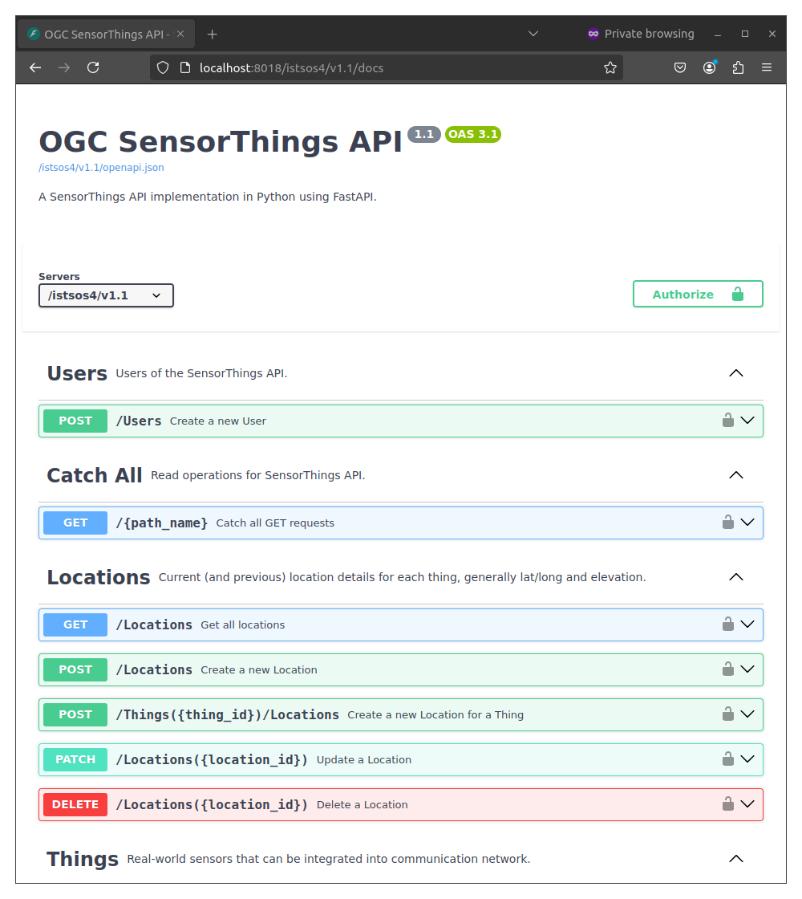
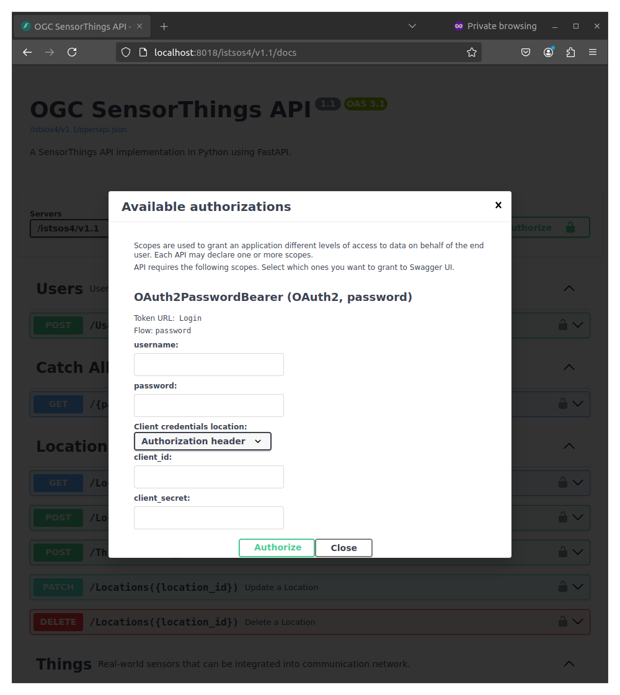
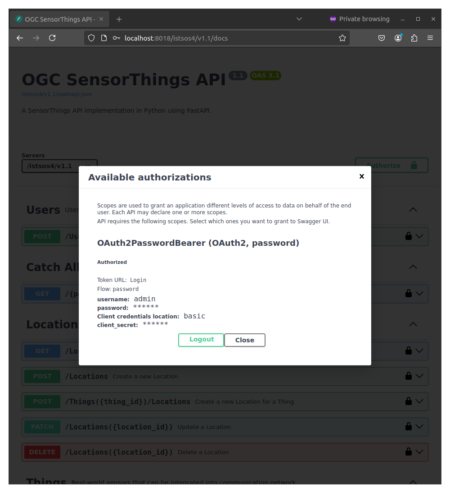
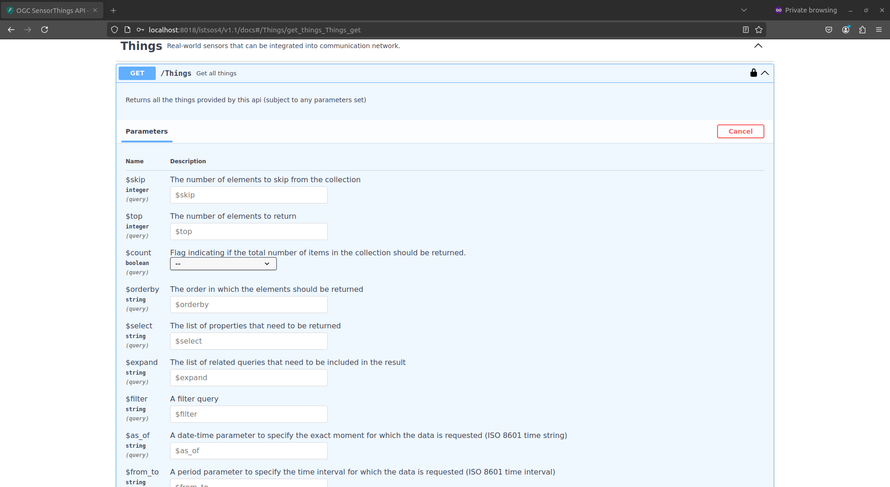

# OAuth 2.0 Overview

OAuth 2.0 (Open Authorization) is an authorization framework that allows third-party applications to grant access to a user's resources without sharing their credentials. It is widely used for secure delegated access to resources across web applications and APIs.

## Check it

Go to the interactive docs at: http://localhost:8018/istsos4/v1.1/docs

You will see something like this:



!!! Authorize button
    You already have a shiny new "Authorize" button.<br>
    And your path operation has a little lock in the top-right corner that you can click.


And if you click it, you have a little authorization form to type a <code>username</code> and <code>password</code> (and other optional fields):



## The <code>password</code> flow

The password "flow" is one of the ways ("flows") defined in OAuth2, to handle security and authentication.

OAuth2 was designed so that the backend or API could be independent of the server that authenticates the user.

But in this case, the same application will handle the API and the authentication.

So, let's review it from that simplified point of view:

- The user types the <code>username</code> and <code>password</code> in the frontend, and hits <code>Enter</code>.
- The frontend (running in the user's browser) sends that <code>username</code> and <code>password</code> to a specific URL in our API (declared with <code>tokenUrl="Login"</code>).
- The API checks that <code>username</code> and <code>password</code>, and responds with a "token"
    - A "token" is just a string with some content that we can use later to verify this user.
    - Normally, a token is set to expire after some time.
        - So, the user will have to log in again at some point later.
        - And if the token is stolen, the risk is less. It is not like a permanent key that will work forever (in most of the cases).
- The frontend stores that token temporarily somewhere.
- The user clicks in the frontend to go to another section of the frontend web app.
- The frontend needs to fetch some more data from the API.
    - But it needs authentication for that specific endpoint.
    - So, to authenticate with our API, it sends a header <code>Authorization</code> with a value of <code>Bearer</code> plus the token.
    - If the token contains foobar, the content of the <code>Authorization</code> header would be: <code>Bearer foobar</code>.

## SensorThings Roles and Permissions
This table outlines the different roles and their corresponding permissions for accessing and managing the various tables within the Sensorthings schema. Each role has a set of privileges that define the level of access granted to specific tables in the system.


| Role          | Table Permissions                                                                                                                                                  |
| ------------- | :----------------------------------------------------------------------------------------------------------------------------------------------------------------- |
| `admin`       | All `PRIVILEGES` on all tables of sensorthings schema                                                                                                              |
| `viewer`      | `SELECT` privilege on all tables (except User table)                                                                                                               |
| `editor`      | `SELECT`, `INSERT`, `UPDATE`, `DELETE` privileges on all tables (except User table)                                                                                |
| `obs_manager` | `SELECT`, `INSERT`, `UPDATE`, `DELETE` privileges on Observation table<br>`INSERT` privilege on FeaturesOfInterest table<br>`UPDATE` privilege on Datastream table |
| `sensor`      | `SELECT` privilege on all tables (except User table)<br>`INSERT` privilege on Observation and FeaturesOfInterest tables<br>`UPDATE` privilege on Datastream table  |


## Authenticate
After authenticating in the system, you will see it like:




### Retrieving Data

To access the data, navigate to the interactive documentation at: <code>/Things</code>.



If you have sufficient privileges to access this table, you will receive the data, such as:
```json
{
  "@iot.as_of": "2024-12-10T13:36:56Z",
  "value": [
    {
      "@iot.id": 1,
      "@iot.selfLink": "http://localhost:8018/istsos4/v1.1/Things(1)",
      "Locations@iot.navigationLink": "http://localhost:8018/istsos4/v1.1/Things(1)/Locations",
      "HistoricalLocations@iot.navigationLink": "http://localhost:8018/istsos4/v1.1/Things(1)/HistoricalLocations",
      "Datastreams@iot.navigationLink": "http://localhost:8018/istsos4/v1.1/Things(1)/Datastreams",
      "name": "thing name 1",
      "description": "thing 1",
      "properties": {
        "reference": "1"
      },
      "Commit@iot.navigationLink": "http://localhost:8018/istsos4/v1.1/Things(1)/Commit(1)"
    },
  ]
}
```

If you do not have the necessary privileges, you will see the following error message:
```json
{
  "code": 401,
  "type": "error",
  "message": "Insufficient privileges."
}
```

If you click the lock icon to log out and attempt the same operation again, you will receive an HTTP 401 error with the following response:
```json
{
  "detail": "Not authenticated"
}
```